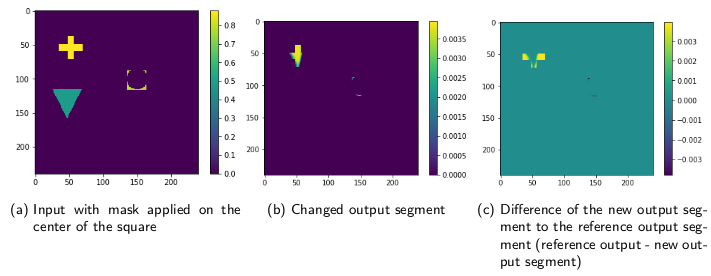
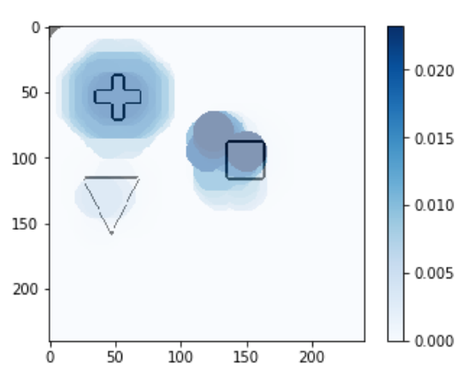

========================
Hausdorff Distance Masks
========================

Introduction
------------

Hausdorff Distance Masks is a new method developed for the interpretability of image segmentation models.
Like RISE, it is a black box method. The output of the method has a higher resolution than
RISE and is more accurate.

How does it work?
-----------------
The first part of the algorithm is the occlusion of parts of the input image.
We iterate over the image in a linear fashion, from left to right and from top to bottom, based on a pixel offset between
every row and column defined as a parameter of the algorithm. For every position that is encountered, we create a new image.
On this image, we draw a filled black circle at the specific position.

The images with the masks applied from above are then passed through the neural networks.
The output segmentation may not change or only change slightly when the mask occludes an unimportant part of the image.
Applying the mask on important parts of the image can change the segmentation output significantly.

   Applying the mask on center of the square (a) significantly changes the segment output (b) of the neural network.
   The network even includes a part of the square in the output segment.

To asses how big the change of the segmentation output is, we use the Hausdorff distance function between
the new segmentation and the ground truth.

To visualize all the distances from the output of the masked image, a new blank image with the same size as the input image is generated.
Next, we iterate over all the positions where masks have been applied to the input image.
Each position has an associated Hausdorff distance which represents the distance of the output segment generated by the masked image and the ground truth segment.
At each position, we draw a circle with the same diameter as used when generating the mask.
The color used to fill this circle represents the Hausdorff distance between the output segment generated by placing a
circle at this exact position and the ground truth segment. The color map is scaled to the minimum and maximum Hausdorff distance encountered on all positions.

   Visualization of all Hausdorff distances corresponding to a mask at the same position.
   Intensity of the circle color is based on the Hausdorff distance at this position.
   The input image was processed with the canny edge detector.

Example
-------
.. code-block:: python

    from interpret_segmentation import hdm

    device = torch.device("cuda:0" if torch.cuda.is_available() else "cpu")

    # a PyTorch model
    model = ...

    # a PyTorch dataset
    dataset = ...

    # ground truth segment (PyTorch 2D tensor)
    segment = ...

    # input image  (PyTorch 2D tensor)
    image = ...

    # initialize the explainer with image width and height
    explainer = hdm.HausdorffDistanceMasks(240, 240)

    # generate masks
    explainer.generate_masks(circle_size=25, offset=5)

    # apply masks and calculate distances
    result = explainer.explain(model, image, segment, device)

    # generate
    raw = result.circle_map(hdm.RAW, color_map='Blues')
    better = result.circle_map(hdm.BETTER_ONLY, color_map='Greens')
    worse = result.circle_map(hdm.WORSE_ONLY, color_map='Reds')

    # show with matplotlib...
    plt.imshow(raw)
    plt.show()

    # ...or save to disk
    raw.save('raw.png')

Class documentation
-------------------
.. autoclass:: interpret_segmentation.hdm.HausdorffDistanceMasks
   :members:

.. autoclass:: interpret_segmentation.hdm.HDMResult
   :members:
