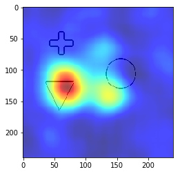

====
RISE
====

Introduction
------------
RISE (Randomized Input Sampling for Explanation) is a black box interpretability method built for image classification tasks.
The original paper is available here: https://arxiv.org/abs/1806.07421.

RISE generates masks that are applied to the input images by multiplying the mask with the input image pixel values:

The modified images are passed through the neural network and the classification score for a specific
class are recorded. A high classification score for a class on a modified input image means that the pixels
preserved by the mask are important for the classification.

To visualize the results, the classification scores and masks are summed up and converted into a saliency map.

Modifications for image segmentation interpretability
-----------------------------------------------------
RISE was built for image classification tasks. To make it work with segmentation, we handle every pixel of the output
segment as if they are  their own distinct class. We let RISE generate a saliency map for every one of these pixels and then merge the
generated saliency maps. Currently, the RISEResult class supports two merge methods: ``max()`` and ``mean()``.

.. figure:: images/rise_max.png
   :scale: 100 %

   Saliency map generated using the max function overlaid on a testnet input image.

   Saliency map generated using the mean function overlaid on a testnet input image.

Example
-------
.. code-block:: python

    from interpret_segmentation.rise import SegmentationRISE
    import torch
    import matplotlib.pyplot as plt
    from pathlib import Path

    device = torch.device("cuda:0" if torch.cuda.is_available() else "cpu")

    # a PyTorch model
    model = ...

    # a PyTorch dataset
    dataset = ...

    # ground truth segment (PyTorch 2D tensor)
    segment = ...

    # input image  (PyTorch 2D tensor)
    image = ...

    # initialize the explainer with image width and height
    explainer = SegmentationRISE(model, (240, 240), device)

    # load or generate RISE masks
    masks_path = Path('rise_masks.npy')
    if not masks_path.exists():
        explainer.generate_masks(N=3000, s=8, p1=0.1, savepath=masks_path)
    else:
        explainer.load_masks(masks_path)

    # generate the saliency map
    with torch.set_grad_enabled(False):
        result = explainer(image)

    rise_max = result.max()
    plt.imshow(rise_max)
    plt.show()

    rise_mean = result.mean()
    plt.imshow(rise_mean)
    plt.show()

Class documentation
-------------------
.. autoclass:: interpret_segmentation.rise.SegmentationRISE
   :members:
   :special-members:

.. autoclass:: interpret_segmentation.rise.RISEResult
   :members:
