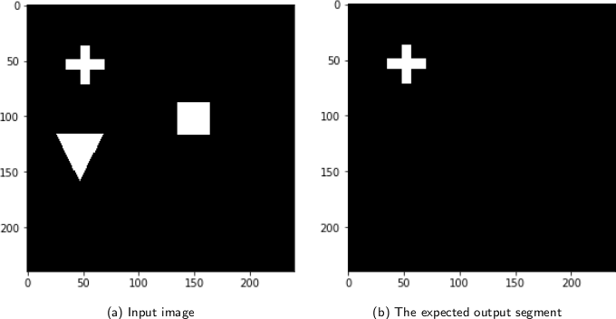
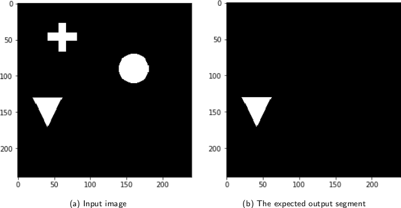

..  _testnet:

=======
Testnet
=======

Dataset
-------
The basic idea in this dataset is to show that not only the pixel data inside the segmentation region is relevant for the network,
but also other parts of the image. To show this, we built a dataset where one part of the image is
essential to generate a correct segmentation output, but is not contained in the segmentation output itself.

The four 2D shapes circle, square, cross and triangle are drawn onto images with the Python Imaging Library.
On the left side of an image, there is always a cross and a triangle displayed. On the right side, in 50\% of the cases a circle is drawn,
in the other 50\% a square is drawn. Depending on the shape on the right side (circle or square), one of the shapes on the left side is segmented.
If the right shape is a circle, the triangle is segmented. If the right shape is a square, the cross is segmented.

Examples
--------

   The right shape in the input image is a square. Therefore the cross is segmented in the output.

   The right shape in the input is a circle. Therefore the triangle is segmented in the output.

A good interpretability method should not only show the importance of the segment output (circle and cross), but also on the shapes on the right (circle, cross).

Model
-----
The model uses the standard U-net architecture for image segmentation tasks.
The dataset generation code and the model training code is located in the ``examples/testnet/`` directory of the git repository.
